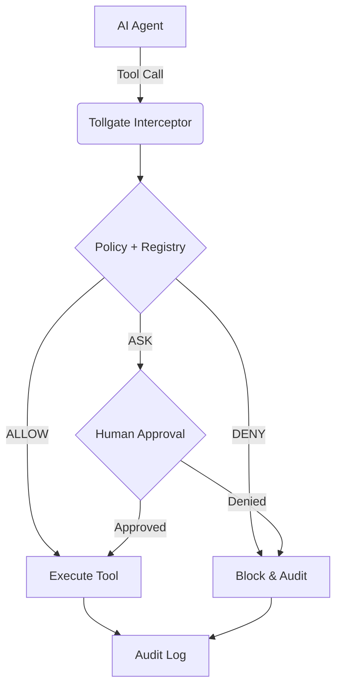

# tollgate 🚪

Runtime enforcement layer for AI agent tool calls using **Identity + Intent + Policy**.

`tollgate` provides a deterministic safety boundary for AI agents. It ensures every tool call is validated against a policy before execution, with support for async human-in-the-loop approvals, framework interception (MCP, LangChain, OpenAI), and structured audit logging.



## ✨ v1 Core Principles

1. **Interception-First**: Enforcement happens at the tool execution boundary via adapters.
2. **Safe Defaults**: Any unknown tool effect or resource defaults to `DENY` or `ASK`.
3. **Trust Model**: Tool metadata is trusted only if it comes from a developer-controlled **Tool Registry**.
4. **Approval Integrity**: Approvals are cryptographically bound to a request hash and correlation ID.
5. **Async-First**: Native support for asynchronous agent loops and approval flows.
6. **Audit as Source of Truth**: Every decision and outcome is recorded with full integrity context.

## 🚀 60-Second Quickstart

### 1. Define a Tool Registry (`manifest.yaml`)
```yaml
version: "1.0.0"
tools:
  "langchain:delete_user":
    effect: "delete"
    resource_type: "user"
```

### 2. Define a Policy (`policy.yaml`)
```yaml
rules:
  - id: ask_delete_user
    tool: langchain
    action: delete_user
    decision: ASK
    reason: "User deletions require human confirmation."
```

### 3. Integrate with LangChain
```python
from tollgate import ControlTower, ToolRegistry, YamlPolicyEvaluator, CliApprover, JsonlAuditSink
from tollgate.interceptors.langchain import guard_tools

# Setup the tower
registry = ToolRegistry("manifest.yaml")
tower = ControlTower(
    policy=YamlPolicyEvaluator("policy.yaml"),
    approver=CliApprover(),
    audit=JsonlAuditSink("audit.jsonl")
)

# Intercept your tools
guarded_tools = guard_tools(my_langchain_tools, tower, registry)

# Inside your agent loop, use guarded_tools just like normal tools.
# Pass agent_ctx and intent to ainvoke() for full gating.
await guarded_tools[0].ainvoke(input_data, agent_ctx=ctx, intent=intent)
```

## 🛠 Supported Frameworks

- **LangChain**: via `guard_tools` interceptor.
- **OpenAI Tools**: via `OpenAIToolRunner`.
- **MCP**: coming soon.

## 📂 Example: Mock Tickets
A full demo is available in `examples/mock_tickets/`. It simulates an agent attempting to close tickets using a Tool Registry and Async approvals.

```bash
# Run Demo
python examples/mock_tickets/demo.py
```

## 📜 Development

```bash
make install
make test
make lint
```

## ⚖️ License
Apache-2.0
