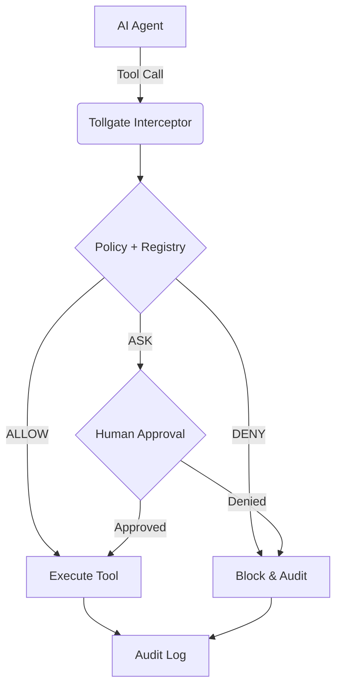

# tollgate 🚪

Runtime enforcement layer for AI agent tool calls using **Identity + Intent + Policy**.

`tollgate` provides a deterministic safety boundary for AI agents. It ensures every tool call is validated against a policy before execution, with support for async human-in-the-loop approvals, framework interception (MCP, Strands, LangChain, OpenAI), and structured audit logging.

**[🚀 Check out the Quickstart Guide](./QUICKSTART.md)**



## ✨ v1 Core Principles

1. **Interception-First**: Enforcement happens at the tool execution boundary via adapters.
2. **Safe Defaults**: Any unknown tool effect or resource defaults to **DENY**.
3. **Trust Model**: Tool metadata is trusted only if it comes from a developer-controlled **Tool Registry**.
4. **Approval Integrity**: Approvals are bound to a request hash and correlation ID with replay protection.
5. **Async-First**: Native support for asynchronous agent loops and non-blocking approvals.
6. **Audit Integrity**: Every decision, approval, and outcome is recorded with full cryptographic context.

## 🚀 v1 Integrations

### MCP (Model Context Protocol)
Wrap an MCP client to gate all tool calls:
```python
from tollgate import ControlTower, ToolRegistry
from tollgate.integrations.mcp import TollgateMCPClient

registry = ToolRegistry("manifest.yaml")
tower = ControlTower(...)
client = TollgateMCPClient(base_client, server_name="my_server", tower=tower, registry=registry)

# Calls are now gated!
await client.call_tool("read_data", {"id": 1}, agent_ctx=ctx, intent=intent)
```

### Strands Agents
Gate Strands tools with minimal friction:
```python
from tollgate.integrations.strands import guard_tools

guarded = guard_tools(my_strands_tools, tower, registry)

# Use guarded tools in your agent
await guarded[0]("input", agent_ctx=ctx, intent=intent)
```

## 📜 Development

```bash
# Install
make install

# Run Tests
make test

# Run Examples (non-interactive)
python examples/mcp_minimal/demo.py
python examples/strands_minimal/demo.py
```

## ⚖️ License
Apache-2.0
